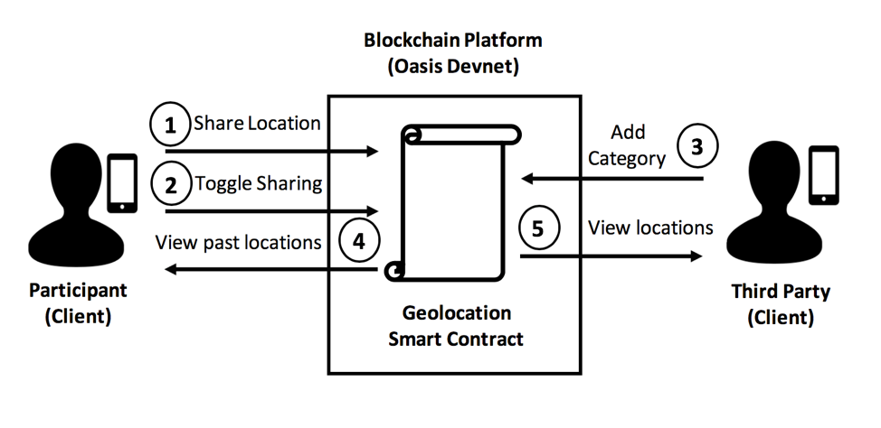

# 📍Geolocation Smart-Contract 📄
[](https://solidity.readthedocs.io/en/v0.5.4/)
[](LICENSE)
[](https://appetize.io/app/zt5wb6e9qpu47ejk7k1ezqzv2c?device=iphonex&scale=75&orientation=portrait&osVersion=12.1&deviceColor=black)


This is the accompanying smart contract for the [Biomedical Data Sharing dApp - Geolocation iOS app](https://github.com/HD2i/Geolocation-iOS). More detailed information can be found there. 

<p align="center">
  
</p>

The workflow of the smart contract is as follows: (1) Participant submits timestamped geolocation data  (2) Participant grants/revokes permission to share that data, to the smart contract (3) Third Party may assign geolocations of interest a matching category (i.e. Hospital, Gym, Pharmacy, or None) and write that mapping to the smart contract (4) Participant can view the timestamp of each of their previously written geolocations and the category of that geolocation, if there exists a mapping between that geolocation and a category that was previously written to the smart contract by a Third Party (5) Third Party can view timestamped geolocation category data for each participant who has enabled the sharing of their data.

## Deployed Contracts

An instance of the non-confidential smart contract was deployed on the [Oasis Devnet](https://docs.oasiscloud.io/en/latest/) at the following address: 

``` 0x29ab9ee6e639bac5a5f2ab7099f48248ed315ffe```


An instance of the confidential smart contract was deployed on the [Oasis Devnet](https://docs.oasiscloud.io/en/latest/) at the following address: 

``` 0xe5a803a386aE4d834943FbfA555A6C395898b74A```


## License

The Geolocation smart contract is released under the [MIT License](LICENSE).
